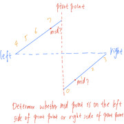

# Leetcode-算法与数据结构

该仓库记录了从2018年至今的刷题记录，包含自己刚开始无头苍蝇一样的随机刷题，到后来跟着覃超系列刷题，再后面工作了跟着左神的视频进行系统的学习，慢慢开始把原来的点开始构建成线，但到2024年找工作始终位还是未构成完成的面，算法的学习是一个持续的事情，要循序渐进，始终学习。


2024面试拼多多时候发现，是一个曾写过的单词搜索问题，但是在面试的场景下，还是想不起来，所以制定了对旧题的复习计划，每天3个题目，2个新题，1个旧题，并总结每个题目的关键词。

# 1、2024年刷题记录

## 2024.04.29

**2个新题：**42接雨水 +128 数组最长连续元素

**1个旧题：**堆排序

**关键词：**

接雨水核心：拆分成子问题，每一根柱子上能装多少水，加起来就是总的水量

数组最长连续元素：借助哈希表的O(1)查询能力，先找到连续数组的起点，然后再找能持续多长

堆排序：堆节点index结构，向上弑君，向下除子

## 2024.04.30

**2个新题：**92反转链表  + 199二叉树右视图

**1个旧题：**小和问题

**关键词：**

反转链表：定义好4个关键变量

二叉树右视图：层次遍历 或者 根右左递归

小和问题：和接雨水有点类似，要看子问题，每个数为小和贡献了多少次，例如 1,3,2,5 ,4
对于1来说，右边有3个比他大 sum += 1*3
对于3来说 sum+= 3*1
对于2， sum+= 2*2
这样想之后才能将其和归并排序结合起来。

## 2024.05.03

**2个新题:** 297二叉树序列化和反序列化 + 200岛屿个数

**1个旧题：**493 逆序对问题

**关键词：**

二叉树序列化和反序列化：孰能生巧 + 字符串下标直接可以找到left节点

岛屿个数： 利用二维数组降低为一维的技巧 利用并查集

逆序对：转换为大和问题


## 2024.05.09

1个旧题: 逆序对问题


## 2024.05.11

1个旧题：25k个一组反转链表 (该题今天面试考到了，现场虽然写出来，但是不够熟练)

关键点：

1、4个变量，之前的头和尾巴，反转后的头，反转后的start, stop，主函数里面两组之间拼接，rt.next, rt = start,stop, 不要忘了rt自己也要更新

2，子函数要返回3个参数，start,stop,next 前两个给组之间合并用，next表示当前head链表的未遍历的第一个元素，给head更新用

## 2024.05.13

92链表翻转2 + k个一组翻转  -- 已完成

https://github.com/lewiscrow/WorkHardAndFindJob/blob/master/%E5%A4%8D%E4%B9%A0/%E9%9D%A2%E8%AF%95/%E5%AD%97%E8%8A%82%E8%B7%B3%E5%8A%A8%E9%9D%A2%E7%BB%8F.md


| 215. 数组中的第K个最大元素 | 3                                                         |
| -------------------------- | --------------------------------------------------------- |
| 145. 二叉树的后序遍历      |                                                           |
| 33. 搜索旋转排序数组       | 按mid在左半边还是右半边来分，在左半边再讨论，右半边再讨论 |


33题关键点：



- If the entire left part is monotonically increasing, which means the pivot point is on the right part
  - If left <= target < mid ------> drop the right half
  - Else ------> drop the left half
- If the entire right part is monotonically increasing, which means the pivot point is on the left part
  - If mid < target <= right ------> drop the left half
  - Else ------> drop the right half

参考链接：https://leetcode.com/problems/search-in-rotated-sorted-array/discuss/14436/Revised-Binary-Search/191339

```java
public int search(int[] nums, int target) {
    if (nums == null || nums.length == 0) {
        return -1;
    }
    
    /*.*/
    int left = 0, right = nums.length - 1;
    //when we use the condition "left <= right", we do not need to determine if nums[left] == target
    //in outside of loop, because the jumping condition is left > right, we will have the determination
    //condition if(target == nums[mid]) inside of loop
    while (left <= right) {
        //left bias
        int mid = left + (right - left) / 2;
        if (target == nums[mid]) {
            return mid;
        }
        //if left part is monotonically increasing, or the pivot point is on the right part
        if (nums[left] <= nums[mid]) {
            //must use "<=" at here since we need to make sure target is in the left part,
            //then safely drop the right part
            if (nums[left] <= target && target < nums[mid]) {
                right = mid - 1;
            }
            else {
                //right bias
                left = mid + 1;
            }
        }

        //if right part is monotonically increasing, or the pivot point is on the left part
        else {
            //must use "<=" at here since we need to make sure target is in the right part,
            //then safely drop the left part
            if (nums[mid] < target && target <= nums[right]) {
                left = mid + 1;
            }
            else {
                right = mid - 1;
            }
        }
    }
    return -1;
}
```


## 2024.05.14

- LRU


- 72编辑距离

关键点: 用临时变量保存dp[j], 更新时候用leftup, 更新完成后给leftup赋值 + 替换，插入，删除都要考虑

- 557反转字符串中的单词 III


- 2最长有效括号

快排

环形链表


# todo 旧题： 

给一个整数数组，找右边元素减左边元素的最大差值

旋转数组

32最长有效括号

- 88 合并两个有序数组


# todo新题

打家劫舍123

2个新题：洪水填充+ [3. 无重复字符的最长子串](https://leetcode.cn/problems/longest-substring-without-repeating-characters/)

# 阿里后端题目

[参考leetcodeTOP](https://github.com/afatcoder/LeetcodeTop/blob/master/alibaba/backend.md)

网站题目频率排序 https://codetop.cc/home

| 算法题                                  | 次数 |
| --------------------------------------- | ---- |
| 215. 数组中的第K个最大元素              | 3    |
| 145. 二叉树的后序遍历                   | 2    |
| 1. 两数之和                             | 2    |
| 232. 用栈实现队列                       | 2    |
| 88. 合并两个有序数组                    | 2    |
| 15. 三数之和                            | 2    |
| 349. 两个数组的交集                     | 1    |
| 5. 最长回文子串                         | 1    |
| 557. 反转字符串中的单词 III             | 1    |
| 72. 编辑距离                            | 1    |
| 543. 二叉树的直径                       | 1    |
| 144. 二叉树的前序遍历                   | 1    |
| 94. 二叉树的中序遍历                    | 1    |
| 剑指 Offer 22. 链表中倒数第k个节点      | 1    |
| 2. 两数相加                             | 1    |
| 70. 爬楼梯                              | 1    |
| 509. 斐波那契数                         | 1    |
| 21. 合并两个有序链表                    | 1    |
| 46. 全排列                              | 1    |
| 82. 删除排序链表中的重复元素 II         | 1    |
| 剑指 Offer 52. 两个链表的第一个公共节点 | 1    |
| 225. 用队列实现栈                       | 1    |
| 350. 两个数组的交集 II                  | 1    |
| 415. 字符串相加                         | 1    |
| 268. 缺失数字                           | 1    |
| 53. 最大子序和                          | 1    |
| 344. 反转字符串                         | 1    |
| 136. 只出现一次的数字                   | 1    |
| 剑指 Offer 24. 反转链表                 | 1    |